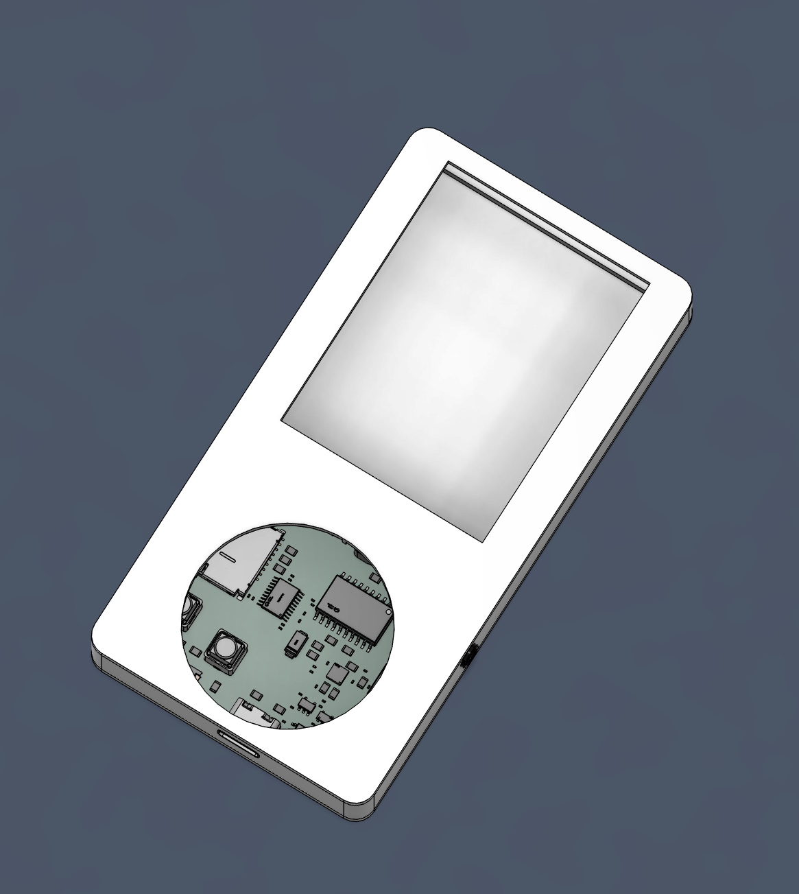
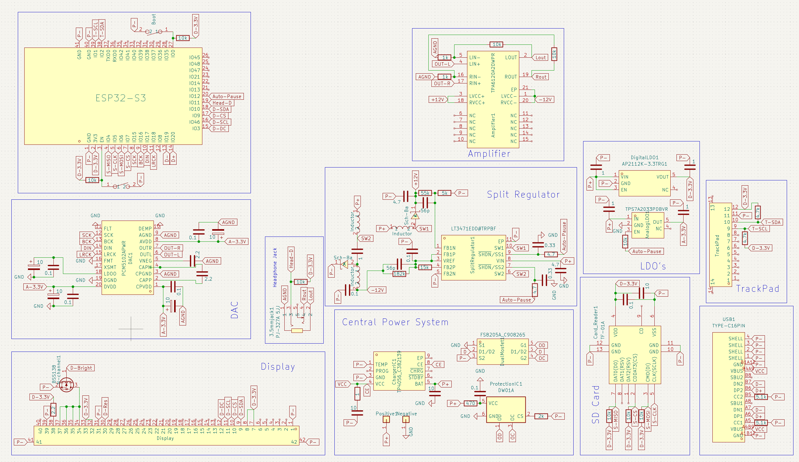
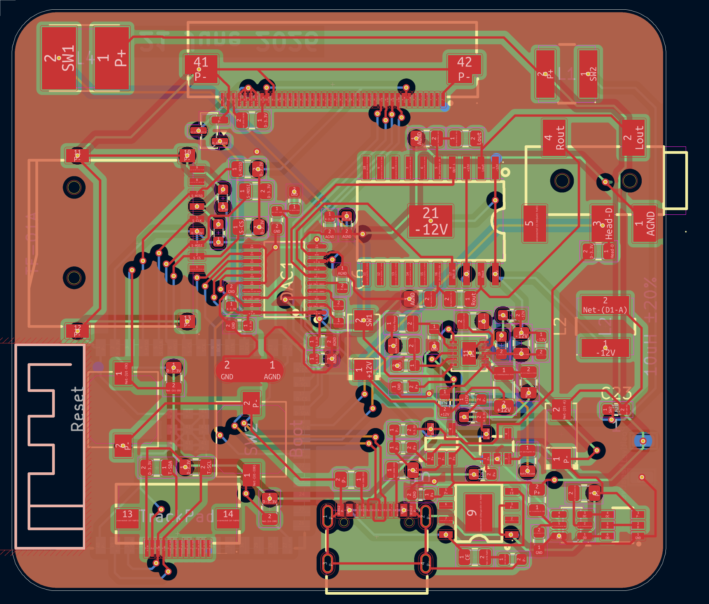

# Singy

This is an mp3 player I build because I wanted a mp3 player because having an MP3 player seems cool but not wanted to buy one.
It is inspired from iPod but it is not that good(I never had iPod). I just find Screen and Circular Controller a nice design.

### Features:

 - Minimilist. Just a display and Trackpad
 - 2.8 inch non touch display
 - Circular trackpad (but no haptics) {for me adding haptics is too much}
 - Have Wifi, Bluetooth and 3.5mm Headphone Jack (but I will only use 3.5mm Jack)
 - Inbuilt DAC and AMP (I hope it has good sound quality)

### CAD Model:
Everything fits together using Glue.

It has 3 separate printed pieces. The BackPanel, the shell , and Front Panel to cover electronics.

Made in Autodesk Fusion.
I didn't inserted 3D model for Display and Trackpad (Because I can't find)
So I will add this when it is completed!!

### PCB:
Here's my PCB! It was made in KiCad. 

Schematic : 
PCB Footprint : 

### Firmware Overview:
Currently Firmware is underdevelopment so there is some time to finished product.
This MP3 player uses CPP for firmware.
Features after completion:
 - Three ways to add new songs
    1. Directly in SD-Card
    2. Through USB Port
    3. Over Wi-fi.
 - The most important feature is it is offline but the Library is always updated
 - In final version, you need to save some of your favourite songs, and at your preferred date and time library will be updated.(Might need a server or device that has wifi and can run continously for this) 

 I might add more in the future! That's the only plan I have now

### BOM Table:
|S. No.|Name|Use|Quantity|
|------|----|---|-----------|
|1|PCB|Main Circuit|1|
|2|ESP32-S3 Wroom 1|Microcontroller|1|
|3|2.8inch Display|Display|1|
|4|Cirque TrackPad|Controlling and Navigation|1|
|5|Battery|Power Source |1|

### Assembly Instructions:
1. Flash PCB with Firmware, connect everything and check if everything is working or not
2. If Everything works, stick battery and PCB to their Respective places.
3. Also Stick Display and TrackPad Carefully to their places
4. Sltick all bodies together and Voila you have an MP3 player

### Extra Stuff:
 Not anything for now but I will surely have when the build is complete.
